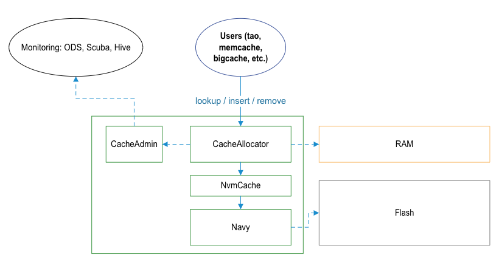
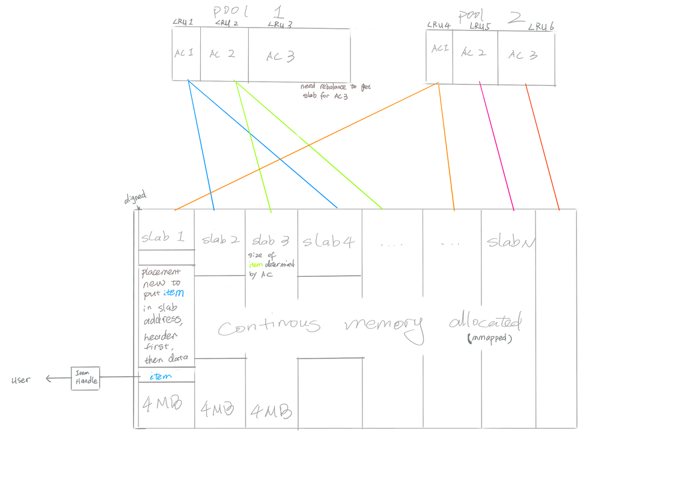

## Team Culture
**[work in progress]**. Refer to [CacheLib Team Work Agreement](https://fb.quip.com/9V15Aar0rOEY)

## Get Started
Read [CacheLib User Guide](https://www.internalfb.com/intern/staticdocs/cachelib/docs/) to understand how cachelib is used by users.

Cachelib has two levels of caches: DRAM and flash([NVM](https://en.wikipedia.org/wiki/Non-volatile_memory)). Each of them is further divided into two types of caches for items smaller or larger than a certain threshold.
- The cache for small items in DRAM is **CompactCache**. (Note: CompactCache is in "maintenance mode" for now)
- The cache for large/regular items in DRAM — it doesn’t have a name!
- The cache for small items in flash is called **BigHash**.
- The cache for large items in flash is called **BlockCache**.
  - BigHash + BlockCache is called Navy.
  - The coordination layer between DRAM cache and Navy is NvmCache.


### SOURCE CODE
```
fbclone fbsource
https://www.internalfb.com/intern/diffusion/FBS/browsedir/master/fbcode/cachelib/allocator
```

Major components:
- DRAM: [CacheAllocator](https://www.internalfb.com/code/fbsource/fbcode/cachelib/allocator/CacheAllocator.h), [MemoryAllocator](https://www.internalfb.com/code/fbsource/fbcode/cachelib/allocator/memory/MemoryAllocator.h), [Item](https://www.internalfb.com/code/fbsource/fbcode/cachelib/allocator/CacheItem.h), [ItemHandle](https://www.internalfb.com/code/fbsource/fbcode/cachelib/allocator/Handle.h)
- NVM: [NvmCache](https://www.internalfb.com/code/fbsource/fbcode/cachelib/allocator/nvmcache/NvmCache.h), [Navy Driver](https://www.internalfb.com/code/fbsource/fbcode/cachelib/navy/driver/Driver.h), [BigHash Engine](https://www.internalfb.com/code/fbsource/fbcode/cachelib/navy/bighash/BigHash.h), [Block Cache Engine](https://www.internalfb.com/code/fbsource/fbcode/cachelib/navy/block_cache/BlockCache.h)
- Admin: [CacheAdmin](https://www.internalfb.com/code/fbsource/fbcode/cachelib/facebook/admin/CacheAdmin.h)
- ML: [ML admission models](https://www.internalfb.com/code/fbsource/fbcode/cachelib/facebook/ml_admission/lightgbm/models/)


IDE: using [VSCode](https://www.internalfb.com/intern/wiki/Vscode/Languages/Cpp/) to navigate code, if navigation doesn’t work try to restart vscode, restart devserver, or alloc a new devserver. A good tool if you use tmux and iterm2: https://fburl.com/wiki/rd80tf81

### UNIT TEST
https://fburl.com/diffusion/j6lky5rc

Build and run:
```
buck test cachelib/allocator/tests:cache-allocator-test -- <test name>
```
For example:
```
buck test cachelib/allocator/tests:cache-allocator-test -- BaseAllocatorTest/1.RebalanceWakeupAfterAllocFailure # (“/1” means different test input)
buck test cachelib/facebook/ml_admission/lightgbm/models/tao/tests:tao_ml_admission_test
buck test cachelib/facebook/ml_admission/lightgbm/models/warmstorage/tests:ap-test
```
Find the TARGETS file for the test file, and look for the target name in TARGETS, then
```
buck test path/related/to/fbcode:target_name
```
This will run all test in the test file, add `-- TestName.FunctionName` to run a single test case in the file.

To run the test binary (debug purpose):
```
buck-out/dev/gen/cachelib/allocator/tests/cache-allocator-test --gtest_filter=<test name>
```

A introduction to [google test](https://developer.ibm.com/articles/au-googletestingframework/).

### CACHEBENCH — PERFORMANCE TEST
[Cachebench Overview](../../Cache_Library_User_Guides/Cachebench_Overview)

Examples given in the above doc is for T10 machine (a production server, [details](https://www.internalfb.com/intern/wiki/Facebook_Server_SKUs/)), following examples can be tried in dev server (it may take more than a hour to finish):
```
./cachebench --json_test_config test_configs/consistency/navy.json —progress_stats_file=/tmp/navy.log
```

### COGWHEEL — CORRECTNESS TEST
CogWheel is a python wrapper of CacheBench for correctness test. This test is run when code is committed to cachelib.

Examples:
```
buck run //cachelib/facebook/cogwheel:cogwheel_cachelib_consistency_navy_with_deletes_with_truncated_alloc_size-launcher -- --build-fbpkg --run-disabled --tests cachelib_cogwheel_test
```
Adding new test config under cachelib/cachebench/test_configs, then add a new target in https://fburl.com/diffusion/ff7c4jhz

To write a new test config for cachebench, see https://fburl.com/wiki/pxz0t4m5

### CANARY TEST
The word “Canary“ means "run your code on real machine so it receives traffic".

Depending on what tool you use, it's different command to run.

For example, you are doing a configerator change, and you want to test this change somewhere (even on your own devserver), you need configerator canary: https://www.internalfb.com/intern/wiki/Configerator/User_Guide/Testing_Configs/Manual_Canary_Testing/

If you build a new package (fbpkg), and you want to run it in your production tier and your production tier is powered by tuppleware, you need tuppleware canary: https://www.internalfb.com/intern/wiki/Tupperware/CLI_References/tw_canary/

It's also possible that your service is managed by ServiceFoundry, then you use sf canary https://www.internalfb.com/intern/wiki/Tupperware/Tupperware_Overview/canaries/

WarmStorage uses sf. I think sf is just a wrapper on top of tuppleware so that it's more service owner oriented.

Then it's also possible that your team built its own tool. For some core data service, we use Service Platform, which is an alternative to tuppleware made by Core Data. https://www.internalfb.com/intern/wiki/Service_Platform/Operations. When you do testing for TAO, you'd run something like svc-experiment tao start-shadow.

### "Shadow" v.s. "Canary".
Shadow means to run two sets of hosts, they run on different binary or configs, but receives the exact same traffic.

Canary only means to put your binary/config to real tier. There is not an explicit comparison and more specifically, hosts on the same tier may not have the exact same traffic.

So shadow is a more delicate testing. Amongst our clients, only TAO has an easy shadow setup (you just run one command). WarmStorage can have shadow, but that involves an engineer manually setting up a cluster and the cluster would have to have at least 20 hosts due to WS's business logic. So we don't really use shadow to test in WarmStorage.

[Here](../Working_Set_Analysis/WSA_logging_library/#canary-test) is an example to run canary test on WarmStorage.

## Oncall
Refer to [CacheLib Oncall Rulebook](https://fb.quip.com/UaCHAuKT2v7I)

### TIPS FOR NEW ONCALL:
- Oncall tasks will topically include the hostname or tuppleware job/task link where you can find the hostname.
- `sush hostname` can login the machine. If there was a crash, core dump is located at `/var/tmp/cores`.
- bunnylol `tw hostname/tw jobname/tw taskid` in Chrome to go to the tuppleware page
- To get the package binary, find the package revision in tupleware page, `fbpkg.fetch revision`
- `machinechecker hostname` to check host hardware healthy
- Please paste any useful information in gdb to the task comment
- To find cachelib stats, go to Scuba and search for cachelib_admin, click the table you need and filter by cache name
    - [cachelib_admin_ac_stats](https://www.internalfb.com/intern/scuba/query/?pool=uber&dataset=cachelib_admin_ac_stats): Allocation Class stats, usually group by allocation size.
    - [cachelib_admin_pool_stats](https://www.internalfb.com/intern/scuba/query/?pool=uber&dataset=cachelib_admin_pool_stats): Pool stats, group by pool id to see each pool’s stats
    - [cachelib_admin_items_stats](https://www.internalfb.com/intern/scuba/query/?pool=uber&dataset=cachelib_admin_items_stats): Items stats.
- logs (`LOG` / `XLOG`) are in tuppleware page, click a task and find “Task Logs” tab. Or `/twlogs/stderr` on the host.
- GDB tips:
    - `info local` to print local variables
    - `fbload stl` to pretty print variables, also has folly and other package (use tab after fbload to get whole list)
- Get coredump remotely: https://www.internalfb.com/intern/wiki/Coredumper/User_Guide/Remote_Coredumps/
Some coredump is unloaded to Manifold, so you don’t have to login the host.

## CacheLib Knowledge
[Onboarding index](https://fb.quip.com/E1AQACtEeYCG)

CacheLib tech talk: https://fburl.com/9lrtnmjp

Some terms:
- MMContainer: eviction queue (e.g. LRU queue/container)
- MMType: eviction policy (LRU/LRU2Q/LFU)
- AccessType/AccessContainer: ChainedHashTable (the only indexing type now), key to item pointer mapping.
- CacheTrait: A combination of AccessType and MMType https://fburl.com/diffusion/6qfp8kkj

## Architecture Overview
### DRAM (REGULAR ITEM)


**Memory**:
1. CacheLib will allocate a continuous memory in the beginning, and split this memory into N 4MB slabs.
2. Each slab will be assigned to an Allocation Class (AC) upon alloc request, and reassigned to a different AC when rebalancing. Also refer to Slab Rebalancing - How Does It Work?
3. Each slab can store 4MB/AC.size items continuously, first few bytes are header then data (key and value) for every item.

**Evict**:
1. Item with Handle hold by user won’t be evicted any way, so if all items are hold alloc will fail
2. Every AC in a pool keeps a LRU (or other evict policy) queue.
3. New item may evict item in slabs with same AC.
4. Pool rebalancer will evict items in an AC to release a slab for other ACs use.

### NVM (BIGHASH)
[BigHash Design](https://fb.quip.com/wTs6A7UMHnwY)

### NVM (BLOCKCACHE)
[Navy 1.5](https://fb.quip.com/nHPsAsvdSHvo)
