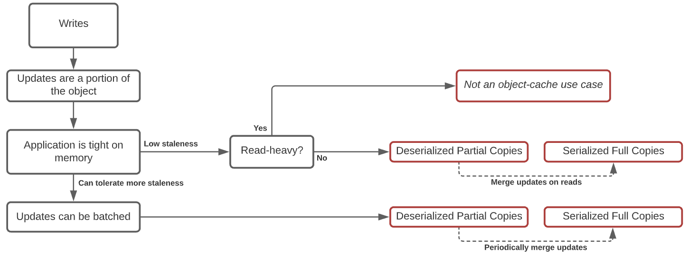

## Goal

This provides a guide for customer to understand for what use cases Object Cache is a right fit. We will provide tips on how to collect metrics and make a decision on whether or not your cache service needs caching objects natively.

## Background

Caching blobs vs caching objects presents a trade-off between memory-efficiency and cpu-efficiency. A serialized (or compressed) blob is dense but requires significant cpu overhead to perform read and write. On the other hand, a regular C++ object can be made very fast but requires much more memory. For example, in Feed’s Object Leaf, fully deserialized objects are 10x the size of serialized objects. For services that need to introspect content in an object, they typically have to spend more memory to get better cpu efficiency.

When a service is bound by CPU, caching objects natively may seem like a natural fit. However, the memory amplification of caching the entire object natively may negate any savings from CPU. Think of a fictional use-case that currently needs additional capacity because it is CPU-bound, but when caching all objects natively, this use-case ends up doubling its memory footprint and need twice as many hosts to main the same hit rate. Caching all objects natively results in a 100% capacity regression for such a use-case.

**Effectively using Object Cache requires a careful evaluation of a service to understand where the constraints are.** With this in mind, we’ll outline a framework for CacheLib customers to understand if and where Object Cache should be used in their service.

## Decision Framework

### What are the Constraints?

A use-case is typically closer on some of these constraints than others. They may want to improve on one or more constraint for efficiency reasons (save $ or enable new feature).

- **CPU** - the more serialized/compressed an object, the more expensive to introspect its content.
- **Cache Storage (ram / flash)** - higher hit rate requires larger cache storage. Deserialized objects require larger cache storage than serialized objects. Keeping full copies of data require larger cache storage than partial copies.
- **Network** - more x-regional network sends cost more $. In-region network is free as long as network utilization is within per-rack limit.
- **Staleness** - how soon should an object be up to date? Lower staleness requires more cache storage and/or higher cpu.
- **Latency** - how quickly should an object be fetched? Lower latency requires more DRAM which cost more $.

### Object Cache Trade-Offs

Object Cache makes the following trade-off on the above constraints

- **CPU** - introspecting deserialized objects is cheaper
- **Cache Storage** - caching deserialized objects require more storage to provide the same hit rate
- **Latency** - introspecting deserialized object is faster

User has three options to use object cache in their caching setup.

**Option 1** is a good choice if application is clearly CPU-bound and has a small working set.

**Option 2** is a good choice if an application is CPU-bound but also has limited headroom in memory capacity. Note this approach assumes the application performs reads and writes on all objects. User can size L1 + L2 accordingly to achieve a balance between CPU and memory consumption.

**Option 3** is where we’re left with if one or more of the following is true:

- Application has very little additional memory headroom.
- Application is working with only a subset of its objects on read and/or write path.

This means we cannot let everything go through object-cache API, and we have to choose what to cache in object-cache versus serialized-cache. We present two decision trees for users to follow. *Note that we do NOT offer a pre-built solution in option-3. We expect the user to compose object-cache and serialized-cache that address their application’s specific usage pattern.*

**Option 3 (a). Writes mutate object. Reads return serialized blob.** In such a scenario, we need to collect two metrics:

- Is the service read-heavy? (Will extra CPU spent on reads negate savings on writes?)
- Can the service tolerate additional staleness?

**Option 3 (b). Reads introspect objects. Writes receive serialized blobs.** In such a scenario, we need to collect two metrics

- Does reads introspect only a portion of an object? (How much?)
- How much overlap there exists between reads?

## Where Does Your Use Case Fit?

Please let us know if your particular usage is not captured in the decision framework above.

CacheLib offers ready-made solutions for options 1 and 2. If you fall under option 3, you likely need a fairly specialized setup. Please reach out to us, and we can work together to figure out how to incorporate object-cache in your setup.
