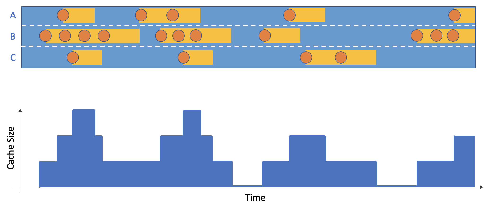
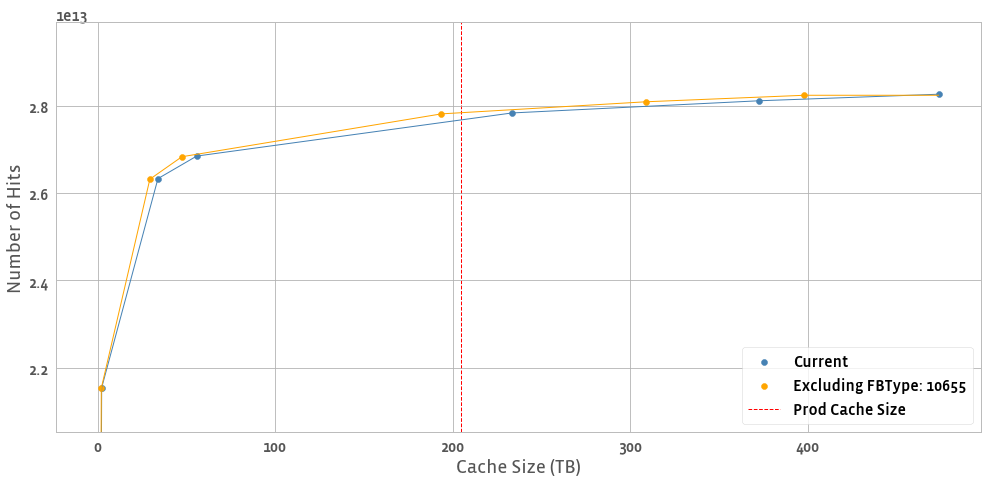

We are currently working on the following cache analyses. By the end of 2021H1 we hope to update this page with a link to an /intern/ tool where WSA users can view the results of these analyses. Until then, please reach out to the WSA team for pointers to Hive tables containing the results.

## Working Set Metrics
We own a series of Dataswarm pipelines which compute aggregate statistics on working sets. At the time of writing, we are paring down a list of metrics to deliver by default for all WSA use-cases. The metrics currently in-scope are:
- Traffic volume and working set size as a function of time
- "Cadence-churn" metrics (e.g. day-over-day) for individual working sets.
- Working set overlap (currently TAO only)

## Hit Rate Analysis - "Guaranteed Eviction Age"
We generate a hit rate estimate as a function of cache size using what we call the "Guaranteed Eviction Age Policy" (we use the term "eviction policy" loosely here because we are not actually simulating the state of a cache). This is a simplistic model for an LRU cache. In literature, modeling LRUs based on a characteristic eviction age is commonly called "Che's approximation" first described in [this paper](https://ieeexplore.ieee.org/document/1031903).

For a series of configurable eviction ages (which range from 1 minute to 1 day by default) we perform the following procedure on a request trace:
- Define the **eviction age** T. Note that this is a separate concept from what we call the "lifetime". A "lifetime" represents an objects entire stay in cache, whereas an "eviction age" only measures time relative to the previous operation. Both concepts are annotated below:


- Mark every request as a **hit** if the time since the previous access is less than T or a **ttl_hit** if the current time is less than the object's current TTL eviction time (if applicable)


- Assume every non-delete operation results in the object staying in cache for the duration T or until the TTL eviction time (if applicable). Compute the top-line cache size as a function of time by summing over the individual stints in cache.



- Aggregate the above results into four additive metrics: hit_count_no_ttl, hit_count, cache_size_bytes_no_ttl, cache_size_bytes. The "no_ttl" metric variants ignore any TTL assignments. This is sometimes useful if users do not want to treat "TTL" as the actual amount of time an object spends in cache.
  - Cache size is computed as a time series based on which items were in-cache at a particular time of day. We often use median(size) filter (size > 0) as the "expected" cache size.

We repeat this above process for a range of T assignments, and every working set dimension specified in the users [working set config](https://www.internalfb.com/code/configerator/source/graphene/working_set/working_set_analysis.cconf?lines=0). The results of this analysis are written to [wsa_guaranteed_lifetime_cache_size:infrastructure](https://www.internalfb.com/intern/data/search/?_v=1648007471&silica_token=HiveTable%2Fwsa_guaranteed_lifetime_cache_size%3Ainfrastructure&surface=info_page).

We compute the analysis this way because (1) running a simulated cache at various sizes for every one of our use cases every day is infeasible and (2) we can filter/aggregate results in a well-founded way during post-hoc analysis. See the example below where we've removed an FBType from TAO follower ASH 0 to compute the new hit count for a single day in Feb. 2021

**TAO ASH - Follower 0**


We call this analysis "optimistic but not optimal". It is optimistic in the following ways:
- It assumes all operations are instantaneous. If two GET operations are simultaneous, the "second one" in our ordering will count as a hit whereas in prod they would both potentially be misses.
- In a similar vein, co-occurring SET/GET/DELETE operations are also ordered optimistically as DELETE->SET->GET.

Additionally, the hit rate generated at a given size is not optimal because of the assumption that, after each access, objects stay in the cache for the entire lifetime duration (an all-knowing cache would evict immediately after the last access). [Truly optimal hit rate analysis](https://www.pdl.cmu.edu/PDL-FTP/associated/pomacs32-berger.pdf) is something we are looking into. In the meantime, it is theoretically possible to observe better results in production than we report from this analysis. However, in practice we have found that our analysis results closely match, or are slightly above, values observed in production.

### Future work
- Surface finer-grained insights about the space between requests for all objects.
- View multiple days' data with error bars, rather than just a line.

## Churn and Value Models
As part of our cache optimization toolkit, we want to find ways to predict how "stale" an object is at any particular time, and use this information to better decide what items to evict / admit into cache. For this analysis we draw a lot of parallels to survival analysis and lifetime value prediction. To date, we have worked on two main churn/value model applications (note here that we are using "churn" in a slightly different context from "working set churn" above; here we borrow from survival analysis and refer to an individual object as "churned" if it is stale or we expect it's future value to be arbitrarily low).

### Time-To-Access (TTA) Eviction for Memcache
[Memcache](https://www.internalfb.com/intern/wiki/Memcache/) is a centralized caching service which handles a variety of disjoint use-cases, each identifiable by key prefix. For TTA evictions, we define a simple value model for all items:
```cpp
future_value = {
    0 if time_since_access > threshold
    1 otherwise
}
```
We compute a unique threshold for every key prefix based on past data as **P95(time_since_access) over (all keys)**. Given that threshold we make a natural decision for items with future_value = 0; namely, evict them from cache entirely. This is currently enforced by periodically scanning Memcache contents for threshold violations. We can define the threshold relative only to the objects initial write (referred to as "single TTA") or on a rolling basis after every request ("continuous TTA").


### ML Admission
TAO, Warmstorage and CDN all use ML to control the rate of flash admissions. A critical note here is that **ML admission policies are only applied for items being evicted from DRAM into flash**, thus we view ML admission similarly to TTA eviction as a **"future value model"**. We partner with MLX and Cachelib to provide training data for these models, which currently use the estimated number of future accesses as the "value" of a particular object (the binary admit / don't admit decision is a rule applied to the regression output e.g. "admit if num_future_requests > 2".

We are currently working with Cachelib to centralize training data for these models. As a result, more Cachelib users should be able to leverage ML flash admission policies without needing to maintain the data collection and model training themselves.

### Ongoing Work
We want to continue to improve on our understanding of object churn and lifetime value. We hope that better understanding here will allow us to enact smarter policies in production. We are currently working with Memcache to expand TTA eviction into an explicit future value (derived from the expected distribution of future accesses) vs cost (I/O vs. space for Flash vs. DRAM) optimization.

## Traffic Partitioning
Two 20TB caches do not have the same performance as a single 40TB cache. One of our custom applications is **arena assignment and sizing for TAO**. TAO followers are partitioned into two separate caches or "arenas". One of these arenas is called the "toxic" arena, and the expectation is that less cache-friendly items will be sent there to keep the overall hit rate high. We use the output of the "Guaranteed Lifetime" pipeline to estimate the relative performance gain of particular arena assignment / sizing options. This work is in early stages, and you can see some tentative results [here](https://www.internalfb.com/intern/anp/view/?id=487387).
