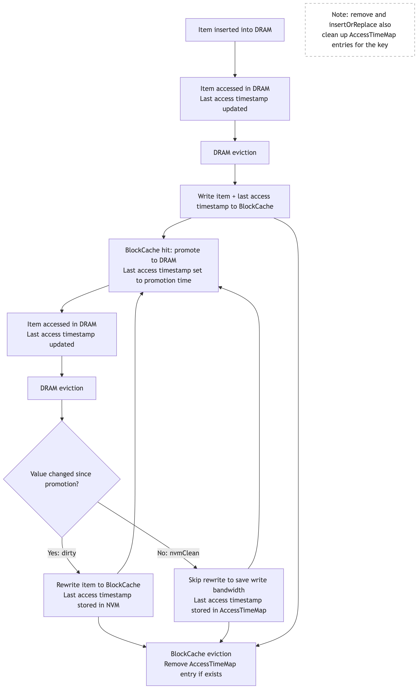
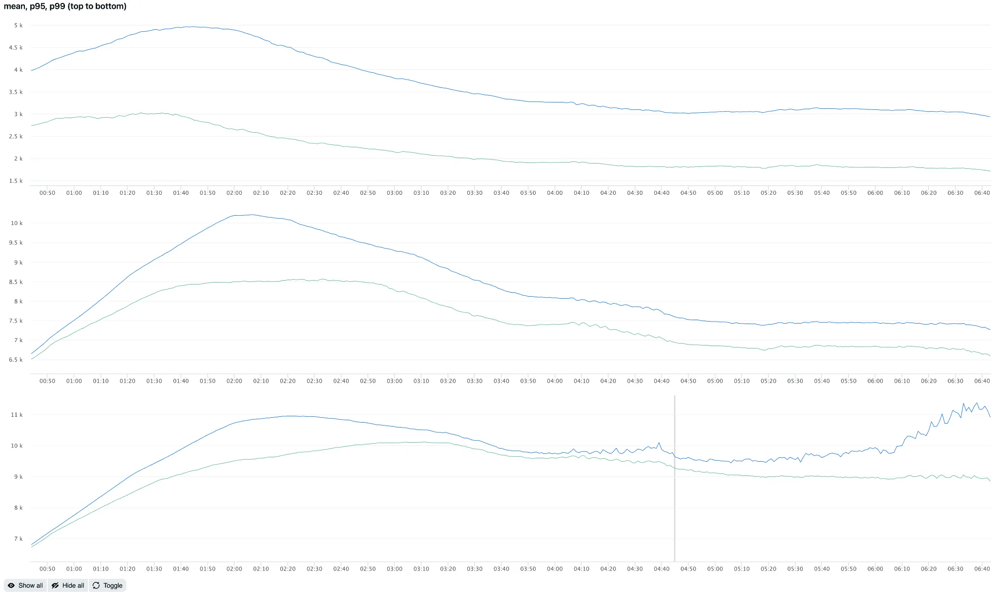
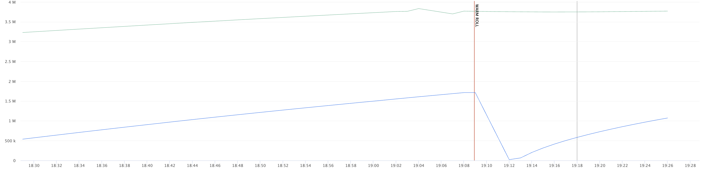

Users can call `.getTTASecs()` on read handles to get the time since a key was last accessed in the cache across both DRAM and BlockCache. CacheLib also exports a `nvm.hit_tta_secs` percentile stat for BlockCache hits, giving users better visibility into their workloads.

<!-- truncate -->

## Problem

**Cache retention is coupled to deployment size.**

When flash capacity grows, retention silently increases — inflating hit rates and setting false performance expectations for tenants. When capacity shrinks or load shifts, retention drops just as silently, hit rates collapse, and backend traffic spikes. For multi-tenant cache services, this coupling makes it hard to provide stable, predictable performance guarantees without over-provisioning. Computing and tracking TTA breaks this coupling by making retention observable and controllable independently of physical cache size.

## Implementation

CacheLib had the following issues that prevented it from tracking TTA:

1. **Not tracking the last accessed timestamp before the current request.** There was no way to access TTA for items in CacheLib. The existing `getLastAccessTime()` on an item returns the timestamp after the current lookup has already updated it — so by the time you read it, it reflects your own request, not the previous access.

2. **Last accessed timestamp lost from DRAM to BlockCache.** Even if we computed TTA in our read handles before updating last accessed time, this would only work for DRAM-only caches as the last accessed timestamp of an item was lost when an item was evicted from DRAM to NVM. So on a NVM hit, we cannot compute the TTA.

3. **Last accessed timestamp would get stale even if we store it in BlockCache.** CacheLib does not rewrite clean items (items whose value hasn't changed since being written to NVM) back to flash because doing so would increase write amplification. But when such an item is promoted to DRAM on a BlockCache hit, receives accesses, and is then evicted without being rewritten, the updated last accessed timestamp is lost and the timestamp stored in BlockCache is stale.

We store the last accessed timestamp in BlockCache when items are evicted from DRAM. Since these timestamps go stale after promotion and subsequent DRAM accesses, we use the AccessTimeMap to track the fresher timestamp for NvmClean items. On a cache hit, we compute TTA from the stored timestamp before updating it to the current time, and expose it through the read handle and stats. The figure below illustrates how the last access timestamp is tracked across DRAM and BlockCache without causing additional writes to NVM.

**Lifecycle of Last Access Timestamp Across DRAM and BlockCache**



## AccessTimeMap (ATM)

ATM is a sharded concurrent hash map that tracks the last accessed timestamp for keys whose value in BlockCache has become stale. When an NvmClean item (an item in DRAM that has an unchanged copy in BlockCache) is evicted from DRAM, we store its last accessed timestamp in the ATM rather than rewriting the item to flash. On lookup, we check the ATM first for a fresher timestamp before falling back to the one stored in BlockCache.

ATM is currently supported for BlockCache only. BigHash stores small items, so adding a timestamp per entry would be a proportionally larger overhead than in BlockCache, reducing the number of items that fit in cache and dropping hit rate. Additionally, BigHash can hold billions of items, so even tracking only NvmClean entries in the ATM could cause the map to grow impractically large.

## Configuration

ATM is not enabled by default. To enable it:

```cpp
navy::NavyConfig navyConfig;
// ... other navy configuration ...

// Enable the AccessTimeMap
navyConfig.setEnableAccessTimeMap(true);

// Optional: cap the map size (0 = unbounded)
navyConfig.setAccessTimeMapMaxSize(1'000'000);
```

## Size

If the size of the ATM exceeds the configured max size, then entries will be dropped. Lost entries fall back to the on-disk NVM timestamp (from original DRAM eviction). TTA calculations use a stale timestamp — items may appear to have longer TTA. No items are evicted or corrupted, only TTA accuracy degrades. This is the same behavior as running without an ATM entirely.

## Persistence

We persist the ATM across warm restarts. This prevents us from having stale timestamps after warm restarts.

```
[AccessTimeMap.h:194] Persisted AccessTimeMap: 3585697 entries, 57371152 bytes to shared memory
[AccessTimeMap.h:295] Recovered AccessTimeMap: 3585697/3585697 entries, 57371152 bytes from shared memory in 0 secs
```

## Experiment

Here is an A/B comparison of running with and without an ATM for the same workload. Without an ATM, TTA is overestimated because BlockCache timestamps go stale after promotion. With ATM, we have fresher timestamps, producing lower and more accurate TTA values. Average TTA was 70% higher without ATM (4.94k vs 2.91k with ATM), p95 was 21% higher (10.2k vs 8.1k), and p99 was 28% higher (11.4k vs 8.9k).

**Mean, p95, p99 with (green) and without (blue) ATM**



**ATM size with (green) and without (blue) persistence**



## Stats

`nvm.hit_tta_secs` (p50, p90, p99, avg) — Time-To-Access in seconds for every NVM cache hit. This stat tells you how recently the items being served from NVM were accessed. Below are the map-specific stats that are exported. The RATE represents value for 60-second intervals.

| **Stat** | **Type** | **Description** |
| --- | --- | --- |
| `navy_atm_size` | COUNT | Current number of entries in the map |
| `navy_atm_sets` | RATE | Entries written (DRAM evictions of NvmClean BlockCache items) |
| `navy_atm_gets` | RATE | Number of lookups |
| `navy_atm_get_and_removes` | RATE | Remove but return the value |
| `navy_atm_removes` | RATE | Entries cleaned up due to removal or eviction from BlockCache |
| `navy_atm_hits` | RATE | Successful lookups (ATM had a fresher timestamp) |
| `navy_atm_misses` | RATE | Lookups where no ATM entry existed |
| `navy_atm_evictions` | RATE | Entries evicted due to ATM size cap |

## Use Cases

- **Retention policy analysis.** What fraction of NVM hits have TTA above a given threshold (e.g., 2 hours)? This approximates the backend traffic increase from enforcing that threshold.
- **TTA-based reaper.** Proactively evict stale items from DRAM and NVM, freeing space and reducing work during region reclaim.
- **TTA-based reinsertion.** Skip reinserting items with TTA that exceeds a threshold during region reclaim, reducing write amplification.
- **Per-tenant TTA policies.** Different tenants can have different TTA thresholds based on their latency sensitivity and backend capacity.
