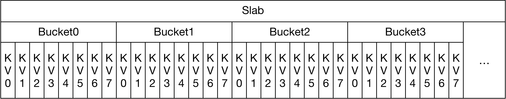

# What is Compact Cache?

Compact Cache is  designed to cache small items with low overheads (0-4 bytes) compared to the regular items cache (32 bytes), making it space efficient when storing small items (tens of bytes). To use compact cache, the key size must be fixed at compile time  for a given instance of compact cache, and value size can be fixed or variable.

# High level design

Cache library's memory management component divides pre-allocated memory into 4MB pieces (slabs), and distribute them to each memory pools according to config. A compact cache instance leverages a memory pool to allocate memory in large chunks and caches smaller object using that.

Each slab is sliced into buckets, the size of each bucket is *(key_size + value_size) * 8,* so the bucket is just an array of 8 key-value pair.

## Finding the bucket for an entry

First, the key is hashed into a number (key_hash), and *key_hash % num_of_slabs* to identify the slab for the key_hash. Inside the slab, *key_hash % num_of_buckets* will find the right bucket. To transparently expand the capacity of the compact cache without losing all its contents, compact cache uses a consistent hashing scheme to map the key hash to slab.

## Reading an entry

After locating the right bucket for the key of entry,  the bucket is locked in shared mode and each entry is iterated in the bucket to match the full key. If a match is found, the value is copied and returned, and the entry is promoted  to the head of the bucket if the option is enabled.

## Writing an entry into compact cache

After locating the right bucket for the key of the entry, the bucket is locked in exclusive mode. Next, a scan is performed to see if key has  exists in the bucket. If the key exists, the value is replaced with the new one and  the entry is promoted to the head of the bucket. Otherwise the a suitable  entry is evicted from the tail of the bucket, and the new entry is inserted at the head of the bucket.

## Compact cache with  variable size values

Compact cache supports variable size values. In this mode, each bucket is fixed size and entries with various sizes are fitted into it by fitting the fixed size keys first and then using the remaining space for variable sized values.

Upon insertion, if there is not enough empty space in the middle, entries are evicted and the new entry is inserted.

# Comparison with regular items cache

By design, Compact cache is meant to be low or zero overhead, which is clearly an advantage from items cache, especially when the item key+value size is very small. It is advised to have key + value sizes be smaller than a cache line size to leverage the efficiency of compact cache.   But there are some limitations also:

* Size of entry has to be small, which will limit the use case of compact cache significantly. If the key/value size is too big, there will be two prominent negative performance impact on read:
   * Searching for the right key will be expensive because the total size of keys in the bucket are way too big compared to the size of CPU cache line.
   * Unlike items cache which can return a folly::IOBuf that holds a refcount on the item, compact cache always copy into the given buffer. This means when the value size is larger, the more inefficient the compact cache becomes.
* LRU/FIFO is on per bucket basis
   * Compact cache can only do LRU or FIFO inside the bucket, which can cause some imbalance between buckets. Some use cases can be sensitive to this (hit rate may be worse).
* Key size is static at compile time
   * Currently Compact Cache does not support variable key size. There is a workaround by padding '\0' bytes at the tail of smaller keys to make all keys at the same biggest size, but obviously this wastes memory, one of the primary motivations for using compact cache.
* Compact cache size needs to be tuned periodically as workloads change.
* There is no native TTL support
* Compact Cache has totally different set of interface compared to items cache

# Possible future improvements

Some explorative ideas to improve the trade-off benefits of compact cache

* Fast entry locating
   * This can be achieved by hashing the keys into one byte each and storing them at the head of the bucket.
   * With  GCC built-in Functions for SSE2/SSE3 Instructions, we can locate keys efficiently instead of comparing them one by one.
* Automatically rebalance the memory pool size between items cache and compact Cache
   * If the resizing can be automated with some metric and strategy setup similar to rebalance between allocation classes inside a memory pool, this will be a huge improvement on performance tuning
* TTL support
* Performance test
   * A helpful setup to identify the break-even key/value sizes for compact cache vs items cache.
* Supporting variable key sizes
   * Current implementation of variable value size is by putting all values at the right side of bucket buffer. We can extend this design by storing the keys at the right side of bucket buffer together with the values
* Unified API for compact cache and items cache, there are couple of options:
   * Have a higher level of API wrapping the CacheAllocator inside that contains one (may be able to support multiple) regular items pool, one compact cache for small items and another compact cache for negative keys. The API can be as simple as:
      * get: find the key from all caches
      * set: put an entry into regular items cache or small item Compact cache depends on entry size, and invalidate the key from other caches
      * setNegative: put an entry into Negative Cache, and invalidate the key from other caches
      * invalidate: invalidate a given key from all caches
      * We can also serialize same-key operation by having built-in lock maps, which was requested by several clients and this feature is missing in cache library
   * Have the same set of interface for compact cache as items cache in cache allocator, like find, allocate, etc. And cache allocator figure out the right place to find/allocate the entry
