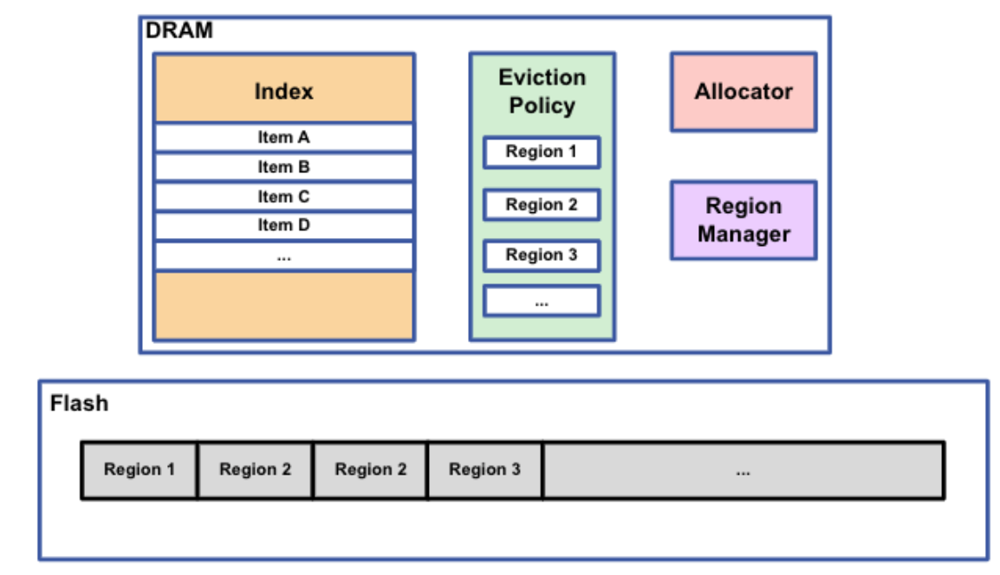
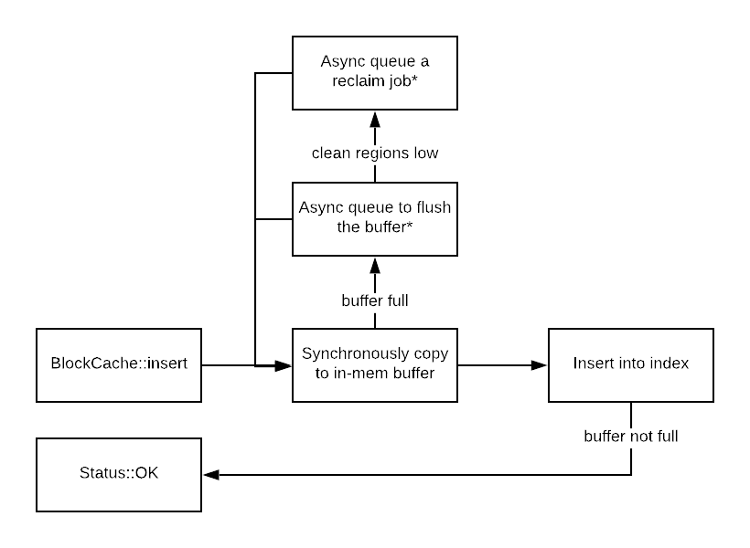

The Large Object Cache (LOC, also known as BlockCache) caches objects that are
larger than KBs in size using 100s of GB of SSD.

## Architecture Overview

LOC splits the flash space into a number of regions, and supports region-based
SFIFO and LRU eviction policy. Each region is by default 16MB, but can be
configured to be up to 256MB. All regions must be identical in size. LOC has an
in-memory index which grows proportionally with the number of items cached.
Items in the index will be replaced on hash collision.

## Removes

Deleting a key just removes the entry from the in-memory index. The space
occupied by the item will be reclaimed after the region it is located in is
reclaimed.

## Inserts

Inserts are asynchronous. We first write a new item into a in-memory buffer
after which LOC will acknowledge the write. If the in-memory buffer (always
associated with a region) becomes full, we will flush it into the flash device
to its corresponding region.

If FIFO region-based eviction policy is configured, the write order is
completely sequential. It resembles the following diagram. Typically, this is
the preferred way to use LOC because it provides the lowest device
ampflication.

To make sure useful (popular) items stay in cache longer, LOC can be configured
with a reinsertion policy. For example, Hits-based reinsertion policy will
reinsert an item back into LOC at eviction time if this item had been accessed
at least once.

## Lookups

To lookup an item, we first look at for its address in the in-memory index.
After which, we need to figure out if the item is located on flash, or is
currently in an not-yet-flushed in-memory buffer. We then read from the
appropriate place and return back to the user.

## Persistence across restarts

LOC serializes all its in-memory structure to the flash device. This includes in-memory index and region metadata.
