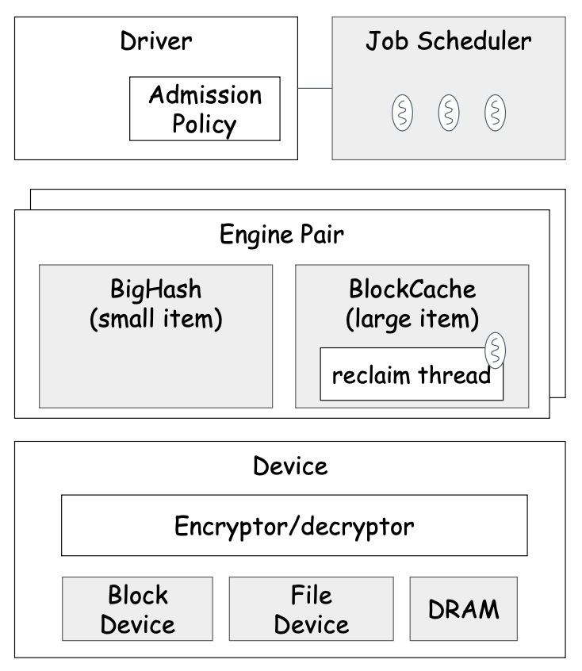
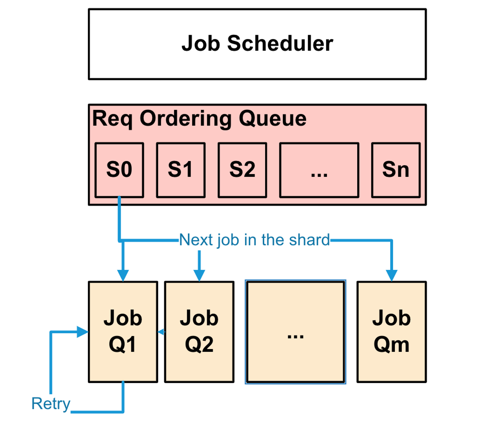
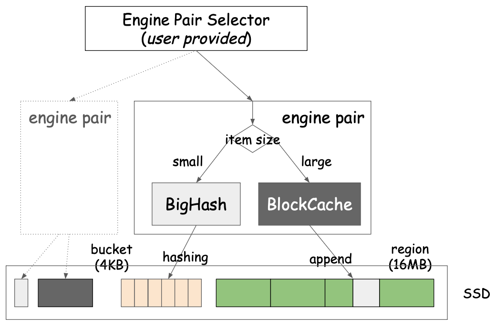

Navy is the SSD optimized cache engine leveraged for Hybrid Cache. Navy is plugged into cachelib via the `nvmcache` interface and turned on by [NavyConfig](/docs/Cache_Library_User_Guides/Configure_HybridCache/).

## Features
- Manages terabytes of data
- Efficiently supports both small (~100 bytes) and large (~10KBs to ~1 MBs) objects
- Sync and async API (supports custom executors for async ops)
- Cache persistence on safe shutdown
- Comprehensive cache stats
- Different admission policies to optimize write endurance, hit ratio, IOPS
- Supports Direct IO and raw devices
- Supports async IO with either [io_uring](https://lwn.net/Articles/776703/) or libaio

## Design overview
There are three over-arching goals in the design of Navy
1. efficient caching for billions of small (\<1KB) and millions of large objects (1KB - 16MB)  on SSDs.
2. read optimized point lookups
3. low DRAM overhead

Since Navy is designed for a cache, it chooses to sacrifice the durability of data when it enables the accomplishment of the goals above. Caches are effective by constantly churning through the items based on popularity, making them write intensive. Since **write-endurance** is a constraint for NVM, the design of Navy optimizes for write-endurance as well.

## Architecture overview

Below figure shows the main components of Navy engine.

### Engine Driver

The engine driver is a simple layer providing the NVM cache interface (i.e., `AbstractCache`) to DRAM cache.

Other than that, the `Driver` is also responsible for performing admission control for insertion  and reinsertions (for BlockCache only). Specifically, the admission policy determines whether to accept items to NVM cache or not depending on different criteria or conditions in order to control the burn rate of the SSD or optimize the NVM cache usage for hit rate or overhead.

There are two levels of admission policies employed; NVM admission policy and Navy admission policy.

#### NVM Admission Policy

The [NVM admission policy](/docs/Cache_Library_User_Guides/Configure_HybridCache/#admission) is mainly to optimize the NVM space usage (for, e.g., higher hit ratio) and the user can provide an arbitrary admission policy implementation.

#### Navy Admission Policy

The [Navy admission policy](/docs/Cache_Library_User_Guides/Configure_HybridCache/#4-admission-policy-settings) is more focused on controlling the burn rate of the SSD by rejecting items randomly for optimizing the endurance of SSD and IOPS. Currently, Navy implements the following Navy admission policy mechanisms that can be enabled:
1. `RejectRandomAP`: Writes are probabilistically rejected based on a configured probabilty.
   - This policy just rejects P% of inserts, picking victims randomly. This policy lets user to reduce the write rate (and so, increase flash lifetime).
2. `DynamicRandomAP`: Tracks the bytes written at device level and ensures the daily budget is under a specified write rate. This is done by doing probabilistic rejection where the rejection probability is updated every X seconds based on the bytes written so far and the budget available for the future. To support this, the bytes written from `Device` is plumbed into the admission policy.
    - This is smart `RejectRandomAP`. User specifies maximum amount of data that can be written to the device per day. Policy monitors write traffic and as it grows beyond target (how much can be written up to this time of the day) it starts randomly reject inserts. It prefers to reject larger items to make hit ratio better. This behavior is tunable. It allows user ultimately control flash wear out.

There are also several parameters that can affect whether the item will be rejected:
- `MaxConcurrentInserts`: writes are rejected once the number of the outstanding inserts including those queued for spooling reached the specified limit
- `MaxParcelMemory`: Each insert job has a memory footprint associated. Writes are rejected once the total amount of memory footprint for all outstanding inserts has reached the limit

### Job Scheduler

`Driver` enqueues the API request as a `Job` to the `JobScheduler`. The jobs can be one of the following types; `JobType::Read` for jobs corresponding to read APIs for Navy (i.e., lookups), `JobType::Write` for jobs corresponding to write APIs for Navy (inserts and deletes). `JobScheduler` is responsible for executing the jobs using its Navy threads.

In order to avoid data races, the job scheduler makes sure at most one job is running for each key via spooling; i.e., the succeeding jobs for the same key are spooled in a queue until the preceding (outstanding) job has been completed. This is important given the async nature of the navy API. With this guarantee, callers can make assumptions about the concurrency of operations once enqueued to navy. This is relevant to using  optimistic concurrency by `NvmCache` implementation.

For the time being, there are two types of the job scheduler provided; `OrderedThreadPoolScheduler` and `NavyRequestScheduler`. The difference is that `OrderedThreadPoolScheduler` runs jobs to completions (including retries), while `NavyRequestScheduler` schedules jobs fully asynchronously as [`Fiber`](https://github.com/facebook/folly/blob/main/folly/fibers/README.md) (i.e., lightweight application thread) to `FiberManager`. Since `NavyRequestScheduler` is more lightweight and scalable, `OrderedThreadPoolScheduler` will soon be deprecated.

#### OrderedThreadPoolScheduler (*to be deprecated*)

To order the jobs, `OrderedThreadPoolScheduler` shards the jobs based on its key into one of several fine grained shards (millions). There can be only one job executed for a given request ordering shard at any given time, and if there is already one being executed, the rest are queued up in a pending job queue. Once the ordering condition is met, Jobs are sharded to be enqueued into one of several `JobQueue`.

The `OrderedThreadPoolScheduler` has two executor thread pools (read and write) and Jobs are sharded by key to the appropriate thread pools. Except `JobType::Read` all other jobs are executed by the writer pool. Each  thread in the pool has a corresponding `JobQueue` and a dedicated thread associate with processing its jobs.

Jobs are processed in FIFO manner and always run to completion, meaning any blocking of a job execution (e.g., for device IO) will block the whole thread until being unblocked.

Jobs can also be retried based on their exit status returned from the implementation. For example, when performing an insert, the job returns to scheduler with returning RETRY if there is no space left for insertion, so that the scheduler can invoke it again later for retry. Jobs are always enqueued to the back of their queue for retry.

#### NavyRequestScheduler
To order the jobs, `NavyRequestScheduler` also uses the same mechanism as `OrderedThreadPoolScheduler`. I.e., `NavyRequestScheduler` shards the jobs based on its key into one of several fine grained shards (millions) and make sure only one job is outstanding by spooling jobs on the shard-specific pending queue.

The `NavyRequestScheduler` also has two executor thread pools (read and write) and Jobs are sharded by key to the appropriate thread pools. Except `JobType::Read` all other jobs (i.e., insert and delete) are executed by the writer pool.

However, unlike `OrderedThreadPoolScheduler`, `NavyRequestScheduler` schedules jobs simply submitting the job as a fiber to the [`FiberManager`](https://github.com/facebook/folly/blob/main/folly/fibers/README.md) that are driven by the Navy worker thread. The jobs are dispatched to workers in the pool in round-robin manner.

Since the jobs are running as a fiber, the job is simply descheduled on blocking for mutex ([TimedMutex](https://github.com/facebook/folly/blob/main/folly/fibers/TimedMutex.h) which is fiber compatible) and the `FiberManager` schedules the next fiber in the `FiberManager` queue. Note that this needs to be paired with appropriate async IO engines at `Device` layer to run the Navy jobs fully async. Below figure shows the queuing architecture of async navy and io operation using [IoUring](https://github.com/facebook/folly/blob/main/folly/experimental/io/IoUring.h).

### Engine

The engine is the core of Navy and implements actual NVM caching algorithms. In order to support wide range of item sizes, Navy provides two types of engines (i.e., `BigHash` and `BlockCache`) which are paired as `EnginePair`. The user can configure multiple `EnginePair`s on a same `Device` for space isolation purposes, where `EnginePair` serves as analogous to the pool for DRAM cache. The user can provide the engine pair selector to decide which `EnginePair` to be used for given item.

BigHash is an engine to store small items (less than device block size). Block Cache (BC) is an engine to store large items (about or greater than device block size). Engines operate independently. The user can set the maximum item size for BigHash which is then used to determine which engine to use to insert items.

This implies that items can be cached in either the small or the large item engine depending on their size. While, size is known during insert, lookups and deletes don't, and hence must check both engines before concluding. Specifically, for lookup, driver performs the lookup in the Large Item engine first and upon a miss, it performs the another lookup on the small item engine. For delete, driver performs the delete to both the small and large item engines.

Besides this, there are no high level locks per key to synchronize concurrent operations across both the engines.

#### BigHash
BigHash is effectively a giant fixed-bucket hash map on the device. To read or write, the entire bucket is read (in case of write, updated and written back). Bloom filter used to reduce number of IO. When bucket is full, items evicted in FIFO manner. You don't pay any RAM price here (except Bloom filter, which is 2GB for 1TB BigHash, tunable).

Read more in [Small Object Cache](small_object_cache)

#### Block Cache

On the other hand, BlockCache divides device into equally sized regions (16MB, tunable) and fills a region with items of arbitrary sizes in append only manner.

BlockCache stores compact index in memory: key hash to offset. We do not store full key in memory and if collision happens (super rare), old item will look like evicted. In your calculations, use 12 bytes overhead per item to estimate RAM usage. For example, if your average item size is 4KB and cache size is 500GB you'll need around 1.4GB of memory.

Since BlockCache stores insert data in append manner to the active regions, it requires to perform the reclaim (a.k.a. garbage collection), which basically select a region and reinsert or evict still valid items. The reclaims are performed by one or more of dedicated threads called `region_manager` threads when the number of reserved clean regions go below the threshold (e.g., 10). Usually, one `region_manager` should be enough for most of the use cases, but need to be increased if needed.

Read more in [Large Object Cache](large_object_cache)

###  Device

`Device` is an abstraction of the backing NVM cache storage and provides APIs to read and write data onto the backing storage.

All IO operations within Navy happen over a range of block offsets. `Device` provides a virtual interface for reads and writes into these offsets. Underneath, the Device could be either a `FileDevice` implementation over one or more regular or raw block device files or an `InMemoryDevice` using a malloc-ed buffer (for testing). `Device` aligns all reads  from its calles to `ioalignSize` that is used to configured the `Device` and trims any extra data that is read.  `Device` also handles opaque functionality like encryption, chunking, latency measurements for reading and writing while delegating the actual reads or writes to underlying implementation.

**Encryption**: `Device` can be initialized with a `DeviceEncrytor` to support block level encryption. All reads and writes pass through the encryption layer and is done at the granularity of encryption block size. Usually the block size for encryption is as small as 4KB. The IO alignment for reads and writes must match the block size used for encryption.

**Chunking**:  Large writes (MBs) can cause head of line blocking for reads on SSDs. To avoid the negative impact on the tail latency for reads, `Device` can be configured to break up writes into chunks and issue them sequentially. While this can increase the latency for writes, read latency can be improved. Reads are not broken into chunks.

**LatencyTracking**: Device also tracks the overall latency for reads and writes in a uniform way across all implementations of Device.

#### FileDevice

`FileDevice` implements `Device` over one or more regular or block device files. When multiple regular or block devices are used, `FileDevice` operates like a software RAID-0 where a single IO can be splitted into multiple IOs in the unit of fixed `stripe` size.  Note, this striping is orthogonal to the chunking that happens with `Device`. Usually, the stripe size is set to the size of a Navy region(16-64MB).

For actual IO operations, `FileDevice` supports both sync and async operations. For async operations, `FileDevice` supports [`io_uring`](https://lwn.net/Articles/776703/) and `libaio` which are supported by [folly](https://github.com/facebook/folly) as `folly::IoUring` and `folly::AsyncIO`, respectively.
