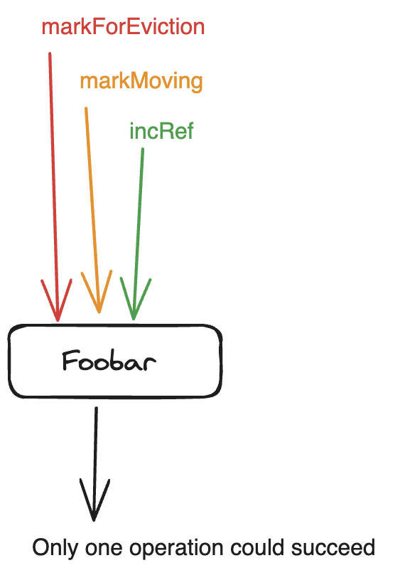
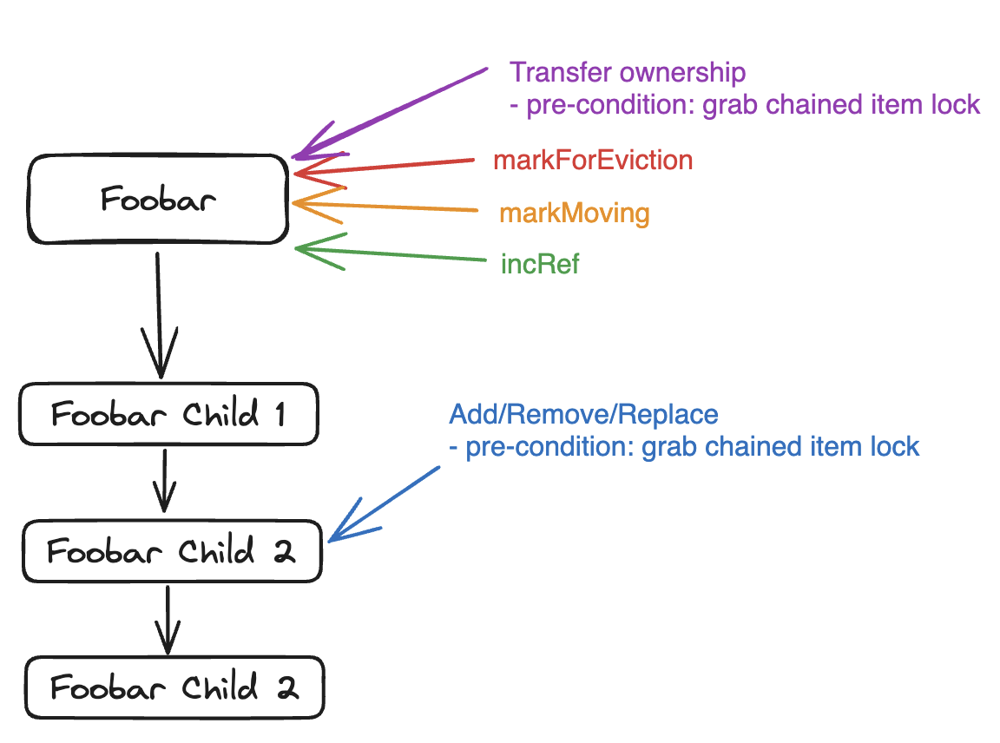

## Overview

There are two paths in CacheAllocator that manages the item memory ownership: eviction & slab-movement. When the cache is full, a user’s allocation will trigger an eviction of an item to free up space for the new allocation. When CacheLib decides to move a slab, we will attempt to move or evict all the items that are currently active in the slab. We won’t discuss why slab movement is necessary. Instead we focus on how synchronization is handled between these two code-paths in CacheAllocator.

Eviction and slab-movement synchronize on an item’s exclusive bit. For chained items, the synchronization happens on its parent item’s exclusive bit.

What is the exclusive bit? This refers to one of the bits in an item’s header. A CacheLib item (cachelib/allocator/CacheItem.h) looks like the following.

```
---------------------
| Intrusive Hooks   |
| Reference & Flags |
| Creation Time     |
| Expiry Time       |
| Payload           |
---------------------
```

Item header refers to all fields above Payload. An item’s ownership management happens within the “Reference & Flags” field (cachelib/allocator/Refcount.h). Its purpose is as follows.

```
  /**
   * Layout of refcount type. This includes the flags, admin ref bits, and
   * refcount. Admin ref encodes special reference counts that contain
   * information on who holds the reference count (like AccessContainer or
   * MMContainer). Flags encode item state such as whether or not it's
   * a chained item.
   *
   * The layout is as follows.
   * |-- flags --|-- admin ref --|-- access ref--|
   * - Flags:  11 bits
   * - Admin Ref: 3 bits
   * - Access Ref: 18 bits
   */
```

The exclusive bit (kExclusive) and isInMMContainer (kLinked) are what we use to synchronize on an item for moving and eviction. They’re part of the Admin Ref. When we mention refcounts, we typically mean Access Ref. These 18 bits are used to count how many outstanding handles there’re for a given item.

**The following table shows when an item can enter into one of the following states.**

<table>
  <tr>
   <td>
   </td>
   <td>Unlinked (not yet inserted in cache)
   </td>
   <td>Linked & Refcount > 0 (being accessed by someone else)
   </td>
   <td>Linked & Refcount == 0 (currently not being accessed by anyone)
   </td>
   <td>Exclusive
   </td>
   <td>Moving
   </td>
  </tr>
  <tr>
   <td>incRef
   </td>
   <td>Yes
   </td>
   <td>Yes
   </td>
   <td>Yes
   </td>
   <td>No
   </td>
   <td>No
   </td>
  </tr>
  <tr>
   <td>markForEviction
   </td>
   <td>No
   </td>
   <td>No
   </td>
   <td>Yes
   </td>
   <td>No
   </td>
   <td>No
   </td>
  </tr>
  <tr>
   <td>markMoving
   </td>
   <td>No
   </td>
   <td>No
   </td>
   <td>Yes
   </td>
   <td>No
   </td>
   <td>No
   </td>
  </tr>
</table>

## Regular Items

There are three ways a regular item’s life-cycle is affected when it is in DRAM cache.

1. User or an internal cachelib thread **acquiring** a refcount on an item. (incRef)
2. User or an internal cachelib thread marking an item for **eviction**. (markForEviction)
3. An internal cachelib thread marking an item for **moving**. (markMoving)



Let’s now look at all the different scenarios the above operations can interact with one another.

**Eviction racing against Acquire**

1. Thread-A: user attempting to acquire an item handle for Foobar
2. Thread-B: user attempting to evict Foobar to make space for another allocation
3. {Thread-A | Thread-B} wins
    1. Thread-A wins. Thread-B will skip Foobar and look for another item for eviction.
    2. Thread-B wins. Thread-A will get a cache miss. This is fine because Foobar is now guaranteed to be freed and will not be visible to any users.

**Moving racing against Acquire**

1. Thread-A: user attempting to acquire an item handle for Foobar
2. Thread-B: cachelib internal thread attempting to move Foobar to another memory location
3. {Thread A | Thread-B} wins
    1. Thread-A wins. Thread-B will retry indefinitely until it’s able to mark Foobar as moving, or if markMoving returns false which indicates the item had already been freed. The latter scenario can happen if Thread-A acquires the item handle first, removes it from the cache, and then drops the handle (if refcount == 0, the item will then be freed).
    2. Thread-B wins. Thread-A will get an async ItemHandle back. This handle will become available when Foobar is successfully moved to another memory location, or evicted in which case the handle will return a cache miss.

**Eviction racing against Moving**

1. Thread-A: cachelib internal thread attempting to move Foobar to another memory location
2. Thread-B: user attempting to evict Foobar to make space for another allocation
3. {Thread A | Thread-B} wins
    1. Thread-A wins. Thread-B will skip Foobar and look for another item for eviction.
    2. Thread-B wins. Thread-A will retry until Foobar is evicted, after which point markMoving will return false, indicating the item had already been freed. Thread-B will skip this item and proceed to move the next item in the slab.

**Eviction, Moving, Acquire all racing against each other**

1. Thread-A: user attempting to acquire an item handle for Foobar
2. Thread-B: cachelib internal thread attempting to move Foobar to another memory location
3. Thread-C: user attempting to evict Foobar to make space for another allocation
4. {Thread A | Thread B | Thread C} wins
    1. Thread-A loses to C. User gets a cache miss.
    2. Thread-A loses to B. User gets a wait-context backed ItemHandle. Handle will be ready after B completes.
    3. Thread-B loses. Retry indefinitely until Foobar can be marked moving or it had already been freed.
    4. Thread-C loses. Skip Foobar and look for another item for eviction.

## Chained Items

There are five ways a chained item’s life-cycle is affected when it is in DRAM cache.

1. User or an internal cachelib thread **acquiring** a refcount on an item.
2. User or an internal cachelib thread marking an item for **eviction**.
3. An internal cachelib thread marking an item for **moving**.

First three are very similar to regular item with two key differences:

* **The synchronization point of a chained item’s lifecycle is through its parent.**
    * The above operations can happen on different chained items belonging to the same chain. But they will still race against one another via the parent of the chained item.
* **They also synchronize on the key’s corresponding chained item lock.**


The last two scenarios are new just for chained items. Instead of the parent item’s exclusive bit, they synchronize on the key’s corresponding chained item lock.

4. User **adding/removing/replacing** a chained item for the same parent item.
5. User or an internal cachelib thread **transferring ownership** of the chain to a new parent item.



Let’s now look at all the different scenarios the above operations can interact with one another.

**Eviction racing against Acquire**

Same as a regular item but everything is synchronized via parent item.

**Moving racing against Acquire**

Same as a regular item but everything is synchronized via parent item.

**Eviction racing against Moving**

Same as a regular item but everything is synchronized via parent item.

**Eviction, Moving, Acquire all racing against each other**

Same as a regular item but everything is synchronized via parent item.

**Transfer-Ownership racing against Eviction**

1. Thread-A: user or an internal thread attempting to transfer the chain to a new copy of Foobar
2. Thread-B: user attempting to evict Foobar to make space for another allocation
3. {Thread-A | Thread-B} wins
    1. Thread-A wins.
        1. Thread-A has the handle to old Foobar and has not yet transferred the chain. Thread-B cannot mark old Foobar as exclusive and will skip it to find another item to evict.
        2. Thread-A has already transferred the chain and dropped the old Foobar handle. Thread B will not come across old copy of Foobar as it will have been freed already.
    2. Thread-B wins. This can only happen if Thread-A has not yet looked up Foobar. After eviction, Thread-A will get a miss.

**Transfer-Ownership racing against Moving**

1. Thread-A: user or an internal thread attempting to transfer the chain to a new copy of Foobar
2. Thread-B: cachelib internal thread attempting to move Foobar to another memory location
3. {Thread-A | Thread-B} wins
    1. Thread-A wins.
        1. Thread-A has the handle to old Foobar and has not yet transferred the chain. Thread-B cannot mark old Foobar as moving and will retry until the chain is transferred. After that it will be the same as the case below.
        2. Thread-A has already transferred the chain and dropped the old Foobar handle. Thread B will call markMovingForSlabRelease and realize the old copy of Foobar has already been freed. So it will proceed to skip to the next item to move in the slab.
    2. Thread-B wins. This can only happen if Thread-A has not yet looked up Foobar. After moving, Thread-A will look up and get the newest copy and proceed the rest in the normal case.

**Chain-Add/Remove/Replace racing against Eviction**

1. Thread-A: user or an internal thread add/remove/replace a chained item
2. Thread-B: user attempting to evict Foobar to make space for another allocation
3. {Thread-A | Thread-B} wins
    1. Thread-A wins.
        1. Thread-A has the handle of Foobar and has not done anything to the chain yet. Thread-B cannot mark old Foobar as exclusive and will skip it to find another item to evict.
        2. Thread-A has finished operating on the chain and has dropped the handle of Foobar. Thread B will evict Foobar and its chained items.
    2. Thread-B wins. This can only happen if Thread-A has not yet looked up Foobar. After eviction, Thread-A will get a miss.

**Chain-Add/Remove/Replace racing against Moving**

1. Thread-A: user or an internal thread add/remove/replace a chained item
2. Thread-B: cachelib internal thread attempting to move Foobar to another memory location
3. {Thread-A | Thread-B} wins
    1. Thread-A wins.
        1. Thread-A has the handle of Foobar and has not done anything to the chain yet. Thread-B cannot mark old Foobar as moving and will retry until Thread-A has completed.
        2. Thread-A has finished operating on the chain and has dropped the handle of Foobar. Thread B will move Foobar and transfer its chained items to the new parent.
    2. Thread-B wins. This can only happen if Thread-A has not yet looked up Foobar. After moving, Thread-A will look up and get the newest copy of the parent and proceed the rest in the normal case.
