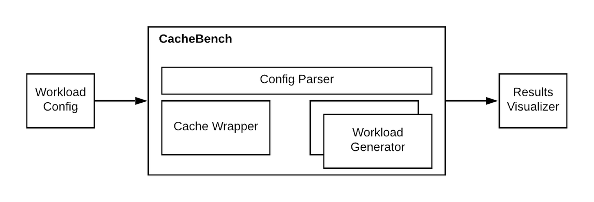

CacheBench is a benchmark and stress testing  tool to evaluate cache
performance with real hardware and real cache workloads. CacheBench takes in a
configuration that describes the cache workload  and the cache configuration
and simulates  the cache behavior by instantiating a CacheLib cache. It runs
the workload and emits  results periodically and at the end. The results
include metrics such as hit rate, evictions, write rate to flash cache,
latency, etc. The workload configs can be hand-written by a human, produced by
a workload analyzer, or backed by raw production cachelib traces. The main
customization points into CacheBench are through writing workload configs or
custom workload generators. See [configuring
cachebench](Configuring_cachebench_parameters) for more details.




## Uses of cachebench

CacheBench can be configured and used for several purposes depending on the
developer's need. The following are few examples.

1. **Prototype and evaluation of cache heuristics**: CacheBench can be used to compare the cache
   performance (hit ratio) of various configuration options for existing
   hueristics and new heuristics. For example, given a cache size and
   workload, comparing LRU vs 2Q vs FIFO vs new heuristic added to CacheLib.

2. **Evaluating throughput and scalability**: By representing the workload in
   CacheBench, you can compare the throughput of various cache setups and
   CacheLib configuration. For example, given a workload, identifying the
   maximum throughput of dram cache and hybrid cache setups as you scale up
   number of application threads or modify CacheLib configuration.

3. **Evaluate hardware choices**: CacheBench workloads can be evaluated on various
   hardware choices to compare the trade-offs between them. For example
   CacheBench can replay the workload against a 100GB dram cache and a 10GB
   dram + 90 GB SSD cache to compare the sensitivity of application
   performance and hardware
   performance.

4. **Testing for correctness and crashes**: When adding new features to
   CacheLib, in addition to unit tests, CacheBench is leveraged to stress test
   the feature's correctness in a concurrent multi-threaded environment.
   CacheBench provides options to ensure the consistency of the cache by
   validating the data correctness of the operations. See [configuring
   consistency
   checking](Configuring_cachebench_parameters#consistency-checking) on how
   this can be enabled. All code changes and new features to CacheLib from
   Facebook go through correctness stress tests with CacheBench.

## Building  cachebench

Follow instructions in [Installation](/docs/installation) to build
cachebench. This should install cachebench in your local machine under
```opt/cachelib/bin/cachebench```
