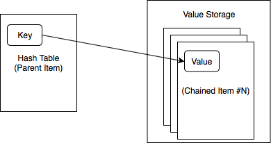

Cachelib enables you to build structured data on top of a cache instead of treating it as just a blob-cache. Data structures let you focus on the actual logic instead of being worried about where a memory allocation comes from. Of course, we're still bound by physical limits such as the 4 MB ceiling for any single piece of allocations, but in practice we rarely need to make use of that big an allocation. We provide a generic memory allocator that can take in one or more buffers of memory (one buffer correspond to an item type in cache). Cachelib data types are built by making use of this memory allocator.

## FixedSizeArray

### Prerequisites for Key and Value
Both key and value must be POD and fixed size.

### FixedSizeArray APIs
For a complete list of FixedSizeArray APIs, see `cachelib/datatype/FixedSizeArray.h`.

User must specify the size of the array before creating it. Creating the array does NOT initialize any data. Users are responsible for initializing the values in the array.
```cpp
// Construct a fixed size array from a WriteHandle
// This modifies the item's memory
// @throw std::invalid_argument  if the item does not have enough memory
template <typename SizeT>
FixedSizeArray(WriteHandle handle, SizeT numElements)

// Undefined behavior if index is out of range
Element& operator[](uint32_t index) { return (*layout_)[index]; }
const Element& operator[](uint32_t index) const { return (*layout_)[index]; }

// Throw std::out_of_range if index is out of range
Element& at(uint32_t index) { return layout_->at(index); }
const Element& at(uint32_t index) const { return layout_->at(index); }
```

## Map

The following sections discuss the `Map` data structure.

### Prerequisites for Key and Value

A `cachelib::Map` is a hash map implementation that can store fixed size key to variable size value. Our map implementation currently has more limitations than `std::unordered_map` due to the nature of cachelib's memory model. The following describes what is required of the `Key` and `Value` types.

A `Key` must be fixed size and memcpy-able. This means it can be an integer, or any fixed size structures, such as the following:


```cpp
struct Key {
  char id1[12];
  int id2;
  char id3[4];
  double id4;
};
```


A `Value` must be memcpy-able. It also cannot contain any pointers to other data structures on heap, which means structures such as `std::map` or `std::string` are not allowed. All the data for `Value` must live in a flat buffer. If it is an integer or a fixed size structure, you don't need to provide any additional method. If it is a variable sized structure, you must provide the method `uint32_t getStorageSize()`. We'll call the method to know how much data we'll need to copy into the map. Here's an example for a variable size `Value`:


```cpp
struct Value {
  uint32_t getStorageSize() const { return sizeof(Value) + size_; }
  uint32_t size_;
  uint8_t data[];
};
```


### Map APIs

For a complete list of the Map APIs, see cachelib/datatype/Map.h.

To create a `Map`, call the `create()` method:


```cpp
// @cache: Your cache object. (I.e. CacheAllocator)
// @pid: This is the pool that you would store this map in.
// @key: Key to look up your map from cache. Note this is not
//       the same key as the key for your map.
// @numEntries: Optional. This specifies the number of keys the map
//              is reserved for.
// @numBytes: Optional. This specifies how many bytes the map will
//            initially reserve for values.
static Map create(
  CacheType& cache,
  PoolId pid,
  typename CacheType::Key key,
  uint32_t numEntries = kDefaultNumEntries,
  uint32_t numBytes = kDefaultNumBytes
);
```


To convert an existing WriteHandle from cache into a `Map`, call the following method:


```cpp
// @cache: Your cache object (i.e. CacheAllocator)
// @handle: Write handle that you just looked up using the
//           same key as when you called Map::create()
static Map fromWriteHandle(CacheType& cache, WriteHandle handle);
```


Call these methods to find out how big a `Map` is:


```cpp
// How many bytes this map occupies in memory.
size_t sizeInBytes() const;

// Return number of entries in this map
uint32_t size() const;
```


To find an entry in an existing `Map`, call these methods:


```cpp
// Return nullptr if not found. If found, returns a pointer
// to EntryValue which contains Key and Value.
EntryValue* find(const EntryKey& key);
const EntryValue* find(const EntryKey& key) const;
```


There're two APIs for insertion. The `insert()` method will only succeed if the key does not exist in the Map, whereas the `insertOrReplace()` method will always succeed and return either `kInserted` or `kReplaced`:


```cpp
bool insert(const EntryKey& key, const EntryValue& value);

enum InsertOrReplaceResult {
  kInserted,
  kReplaced,
};
InsertOrReplaceResult insertOrReplace(
  const EntryKey& key,
  const EntryValue& value
);
```


To erase an existing key, call the `erase()` method and pass in the key to be deleted from the `Map`. Note that this does not free up any storage. A `Map`'s storage is lazily reclaimed during an insertion or can be triggered by your calling the `compact()` directly.


```cpp
bool erase(const EntryKey& key);
```


To run compaction explicitly, call the `compact()` method. This operation may take up to O(M + N) time, where M is the number of entries in the `Map` and N is the number of buffers of memory used underneath this `Map`. In practice, M >> N.


```cpp
void compact();
```


### Map architecture

Our map implementation uses robin-hood hash table to achieve high load factor and a stack allocator for simplicity. In terms of memory layout, `cachelib::Map` always makes use of at least two buffers (cachelib items). The first buffer (parent item) is used for hash table and the second (and third, and fourth, etc.) is used to store values. Our design (like any data structures) comes with a fixed up-front cost in storage and also per-entry storage overhead. The numbers currently are 16 bytes per entry (12 bytes for the hash table and 4 bytes for each value allocation), and 20 bytes of fixed cost. Each additional value buffer (which can fit multiple values) adds another 12 bytes.





Each of the item is allocated through `CacheAllocator`. But the map itself doesn't care about where the memory comes from; it only cares that it has a number of preallocated fixed size buffers to work with. When looking up a key, first we locate the key in the hash table where we store an address offset for the value. Then we use this address offset to locate which buffer the value is in and the relative offset in that buffer it is at. When we're near capacity for the hash table, we will expand the buffer (parent item) for the hash table and rehash the keys. When we're near capacity for value storage, we'll add another buffer (chained item) and allocate from the new buffer.

This design introduces an extra complexity not found in something like `std::unordered_map`. Namely in a multi-threaded environment, as the map expands its storage in one thread, it may leave the map in another thread stale. This is because when we first look up the map from cache, we compute some states regarding the map storage and store them on the stack (inside the `Map` object itself). Whenever storage expands, we must recompute these stats. To avoid a situation where one thread triggers a storage expansion and make the other thread's instance of the same map invalid, we fork (copy the entire content in the map to a new set of buffers) when it is necessary to expand the underlying storage. What this means is that if another thread inserts a few items into the map that triggers a storage expansion, the current thread's map copy becomes stale (it is still valid to read from, but you may be reading stale data. And if you write, your writes will be lost.).

So to use `cachelib::Map` properly in a multi-threaded environment, follow these rules:

**Read**

1. Look up item handle from cache and convert it to an instance of `cachelib::Map`.
2. Grab the read lock.
3. Read.

**Write**

1. Grab the write lock (note: must always grab the write lock before looking up for the map in cache).
2. Look up item handle from cache and convert it to an instance of cachelib::Map.
3. Write.

## RangeMap

Unlike `Map`, `RangeMap` exposes an ordered map implementation.The following sections discuss the `RangeMap` data structure.

### Prerequisites for Key and Value

The `Key` and `Value` for `RangeMap` have the exact same requirements for [Map](#Map ). In addition, `Key` must support the equality and comparison operators (e.g., `operator==`, `operator!=`, `operator<`, `operator>`, etc.).

### RangeMap APIs

For a complete list of the RangeMap APIs, see `cachelib/datatype/RangeMap.h`.

To create a RangeMap, call the `create()` method:


```cpp
// Create a new cachelib::RangeMap
// @param cache   cache allocator to allocate from
// @param pid     pool where we'll allocate the map from
// @param key     key for the item in cache
// @param numEntries   number of entries this map can contain initially
// @param numBytes     number of bytes allocated for value storage initially
// @return  valid cachelib::RangeMap on success,
//          cachelib::RangeMap::isNullWriteHandle() == true on failure
static RangeMap create(
  Cache& cache,
  PoolId pid,
  typename Cache::Key key,
  uint32_t numEntries = kDefaultNumEntries,
  uint32_t numBytes = kDefaultNumBytes
);
```


To convert an existing `WriteHandle` from cache into a `RangeMap`, call the following method:


```cpp
// Convert a item handle to a cachelib::RangeMap
// @param cache   cache allocator to allocate from
// @param handle  parent handle for this cachelib::RangeMap
// @return cachelib::RangeMap
static RangeMap fromWriteHandle(Cache& cache, WriteHandle handle);
```


To find out a RangeMap's size and get the capacity of the index (how many entries can fit before we have to expand the index size), call these methods:


```cpp
// Return number of bytes this map is using for hash table and
// the buffers. This doesn't include cachelib item overhead.
size_t sizeInBytes() const;

// Return number of elements in this map.
uint32_t size() const {
  return handle_->template getMemoryAs<BinaryIndex>()->numEntries();
}

// Return capacity of the index in this map.
uint32_t capacity() const {
  return handle_->template getMemoryAs<BinaryIndex>()->capacity();
}
```


There're two APIs for insertion. The `insert()` method will only succeed if the key does not exist in the `RangeMap`, whereas the `insertOrReplace()` method  will always succeed and return either `kInserted` or `kReplaced`. The cost of insert is typically O(N) as we have to insert data into the binary index. This means the insertion performance will degrade rapidly if the index size grows too large (e.g., beyond 1000s).


```cpp
bool insert(const EntryKey& key, const EntryValue& value);

enum InsertOrReplaceResult {
  kInserted,
  kReplaced,
};
InsertOrReplaceResult insertOrReplace(
  const EntryKey& key,
  const EntryValue& value
);
```


To remove an existing key, call the `remove()` method and pass in the key to be deleted from the `RangeMap`. Note that this does not free up any storage. The `RangeMap`'s storage is lazily reclaimed during an insertion or can be triggered by your calling the `compact()` method directly.


```cpp
bool remove(const EntryKey& key);
```


To run compaction explicitly, call the `compact()` method. This operation may take up to O(M + N*LOG(N)) time,  where N is the number of entries in the map and M is the number of buffers of memory used underneath this map. In practice, N >> M.


```cpp
void compact();
```


Up until now, the `RangeMap` API looks very similar to `cachelib::Map`’s API. However, lookups in a `RangeMap` work differently. A `RangeMap` is an ordered map and supports point-lookup, range-lookup, and approximate range-lookup. The APIs typically return an iterator or a range of iterator. The cost of lookup is usually log(N).


```cpp
// Return an iterator for this key. Can iterate in sorted order.
// itr == end() if not found.
Itr lookup(const EntryKey& key);
ConstItr lookup(const EntryKey& key) const;

// Return an exact range or null if not found. [key1, key2] are inclusive.
folly::Range<Itr> rangeLookup(const EntryKey& key1, const EntryKey& key2);
folly::Range<ConstItr> rangeLookup(
  const EntryKey& key1,
  const EntryKey& key2
) const;

// Return cloest range to requested [key1, key2]. Null if nothing is in map.
// I.e. for input [5, 10], we might return [6, 9].
folly::Range<Itr> rangeLookupApproximate(
  const EntryKey& key1,
  const EntryKey& key2
);
folly::Range<ConstItr> rangeLookupApproximate(
  const EntryKey& key1,
  const EntryKey& key2
) const;
```


### RangeMap architecture

The `Value` storage is identical to `cachelib::Map`. The main difference is in the index. We use a binary index to support efficient range lookups and ordered iteration. The index itself is just a sorted array of `{key, compressed ptr}`. The cost of a lookup is O(LOG(N)). The cost of an insert is typically O(N) as we have to insert data into the binary index. This means the insertion performance will degrade rapidly if the index size grows too large (e.g., beyond 1000s).

For read and write operations, you must use locks the way they're used for cachelib::Map. It means to use range map properly in a multi-threaded environment, you have to follow the following rules:

**Read**

1. Look up an item handle from cache and convert it to an instance of `RangeMap`.
2. Grab the read lock.
3. Read.

**Write**

1. Grab the write lock (note: must always grab write lock before looking up for the map in cache).
2. Look up the item handle from cache and convert it to an instance of `RangeMap`.
3. Write.
