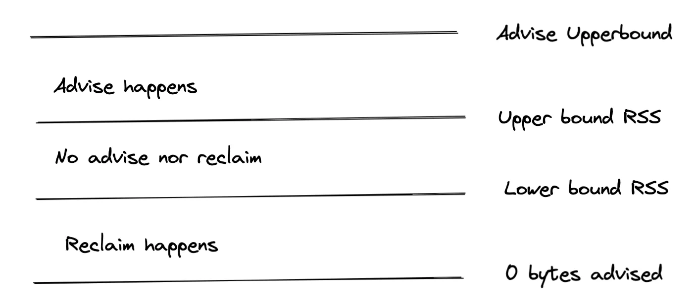

Cachelib can dynamically *grow or shrink the total cache footprint* from its configured size based on the memory pressure in your system. We call this feature `MemoryMonitor`. When it is enabled, cachelib watches for the memory pressure through system metrics and releases cache memory back to the system. When the memory pressure eases, cachelib can reclaim back the memory and grow to its configured size. `MemoryMonitor` enables you to size your cache without having to worry about your system's running out of memory when regular heap memory grows or system free memory drops. It also enables you to be *less relaxed about coming up with an optimal cache size* or relaxing the head room you need to maintain in anticipation of sudden memory growth.

For example, suppose you had 60 GB of memory available for your operating process and decide to dedicate 30 GB for cachelib and your application heap consuming 20 GB. This leaves a head room of 10 GB for free memory in the system. Cachelib ensures that the cache memory never grows beyond 30 GB. However, the same may not be the case for your application's heap usage or other system resources. When you face a regression in either case, you devour your free memory and will eventually run out of memory (OOM). With `MemoryMonitor`, you can configure cachelib to maintain the 10 GB head room even when the heap or other resources consume more than what is expected. This allows your cache to shrink below the configured 30 GB and grow back when memory pressure goes away. This effectively makes a OOM/SEV like situation more manageable to deal by rather lowering your hit ratio. Furthermore, you can be more aggressive about setting the free-memory even lower and rely on cachelib using up as much memory for caching and releasing it back when needed for your application.

## Enabling MemoryMonitor

`MemoryMonitor` is available in two modes depending on whether your binary runs in containers or runs without any containers. There are some parameters that are common between the two and some that are contrary. So make sure you understand the semantic differences.

### Free memory mode

In this mode, you ask cachelib to monitor the *total free memory* in the system and give up the cache memory when free memory dips below a certain margin. This is useful mode when your process is the dominant one in the whole machine and you are not running in any container environment.


```cpp
config.enableMemoryMonitor(
    std::chrono::seconds(interval),
    memoryMonitoringConfig,
    std::shared_ptr<facebook::cachelib::LruTailAgeStrategy>());
```


* **interval**:
This specifies the frequency at which cachelib monitors the system free memory and decides to shrink or grow the cache.

* **memoryMonitoringConfig**:
Specifies the memory monitoring configuration settings in `MemoryMonitor::Config` below:

  * `mode` Specifies free memory monitoring mode: `MemoryMonitor::FreeMemory`
  * `maxAdvisePercentPerIter` Specifies the maximum amount of memory that can be advised away in *each iteration* (configured by the interval above). This is specified as a percentage of the difference (`upperLimitGB - lowerLimitGB`). Default value is `5`.
  * `maxReclaimPercentPerIter` Specifies the maximum amount of memory that can be reclaimed in *each iteration* (configured by the interval above). This is specified as a percentage of the difference (`upperLimitGB - lowerLimitGB`). Setting this too high is not recommended. Default value is `5`.
  * `maxAdvisePercent` Specifies the maximum percentage of the overall cache size that can be advised away. Default value is `20`.
  * `lowerLimitGB` Free memory value at which the cache will start advising away memory to increase the system free memory. Default value is `10`.
  * `upperLimitGB` Free memory value at which the shrunken cache will start reclaiming previously advised away memory. Default value is `15`.
  * `reclaimRateLimitWindowSecs` Growing cache while free memory is falling can cause OOMs. This configuration specifies a window of time over which rate of decrease in free memory is monitored to throttle growing cache. Default value is `0`.

* **strategy**:
Strategy to use for freeing up the memory. For more information, see [Pool rebalance strategy](pool_rebalance_strategy).

For example, if your `config.size` was 100 GB and you are running on a system with 144 GB, with intent to have free memory around 10 GB. Setting `lowerLimit=10GB`, `upperLimit=15GB`, `maxAdvisePercentPerIter=10`, `maxAdvisePercent=8` would make cachelib give away cache memory when free memory is below 10 GB and grow back the cache when free memory jumps above 15 GB. While shrinking, it will give away 10% * (15GB - 10GB) = 500MB in each iteration and only give up a maximum of 8% of the cache, which is 8 GB at the maximum. Note that if your heap usage regresses by more than 8 GB, this means that cachelib can no longer shrink itself to save you from dipping below your expected 10 GB head room.

### Resident memory mode

Your process may be running inside a container where a OOM is a result of your process exceeding container memory limits. The `ResidentMemoryMode` is applicable when you run your process in a container and need to monitor the memory usage of the process to stay within the container limits as opposed to overall system free memory. In this mode, cachelib watches the process resident set size (RSS) footprint to figure out when cachelib could shrink the cache size to keep the overall process RSS under the expected limit.


```cpp
config.enableMemoryMonitor(
    std::chrono::seconds(interval),
    memoryMonitoringConfig,
    std::shared_ptr<facebook::cachelib::LruTailAgeStrategy>());
```


The semantics of `interval`, `memoryMonitoringConfig`, and `strategy` remains the same as those defined in free memory monitor mode. The following `memoryMonitoringConfig` parameters are different to reflect the process RSS (used in exactly opposite ways to `FreeMemory` mode):

* `mode`
Specifies resident memory monitoring mode: `MemoryMonitor::ResidentMemory`
* `lowerLimitGB`
Process RSS size at which the cachelib can grow back the shrunken cache.
* `upperLimitGB`
Process RSS size at which cachelib shrinks the cache to keep the process RSS below the configured limit.
* `reclaimRateLimitWindowSecs`
Growing cache while process RSS size is increasing can cause OOMs. This configuration specifies a window of time over which rate of increase in process RSS size is monitored to throttle growing cache.

For example, if you have configured 100 GB cache on a 144 GB container. Setting `upperLimit=120GB` and `lowerLimit=110GB` tells cachelib to start shrinking the cache when the process RSS grows beyond 120 GB. When the regression goes away and the process RSS is below 110 GB, cachelib slowly grows back the cache memory until the process RSS reaches 120 GB.

Below is a diagram for how Memory Monitor works in RSS mode. For free-memory mode, the upper and lower bounds are reversed.



## Pools and MemoryMonitor

When pools are enabled, cachelib grows and shrinks the cache relative to each pool size. For example, if you have pools `A`, `B`, `C`, each taking up 30%, 50%, and 20% of the cache and cachelib decides to shrink the cache by 1 GB, `A` would shrink by 300 MB, `B` would shrink by 500 MB, and `C` would shrink by 200 MB to make up for the 1 GB.  The pools would grow back in similar fashion when memory pressure eases.

## Monitoring metrics

When using memory monitor, call the `getCacheMemoryStats()` method to get the current state of cache memory:


```cpp
struct CacheMemoryStats {
  // current memory used for cache in bytes. This excludes the memory used for
  // slab headers and the memory returned temporarily to system (i.e., advised).
  size_t ramCacheSize{0};

  // configured total ram cache size, excluding memory used for slab headers.
  size_t configuredRamCacheSize{0};

  // configured regular pool memory size in bytes.
  // the actually used size may be less than this
  size_t configuredRamCacheRegularSize{0};

  // configured compact cache pool memory size in bytes
  // the actually used size may be less than this
  size_t configuredRamCacheCompactSize{0};

  // current advised away memory size in bytes.
  size_t advisedSize{0};

  // maximum advised pct of regular cache.
  size_t maxAdvisedPct{0};

  // amount of memory that is not assigned for any pool in bytes
  size_t unReservedSize{0};

  // size of the nvm cache in addition to the ram cache.
  size_t nvmCacheSize{0};

  // amount of memory available on the host
  size_t memAvailableSize{0};

  // rss size of the process
  size_t memRssSize{0};

  // returns the advised memory in the unit of slabs.
  size_t numAdvisedSlabs() const { return advisedSize / Slab::kSize; }

  // returne usable portion of the cache size
  size_t usableRamCacheSize() const { return ramCacheSize; }
};
```
